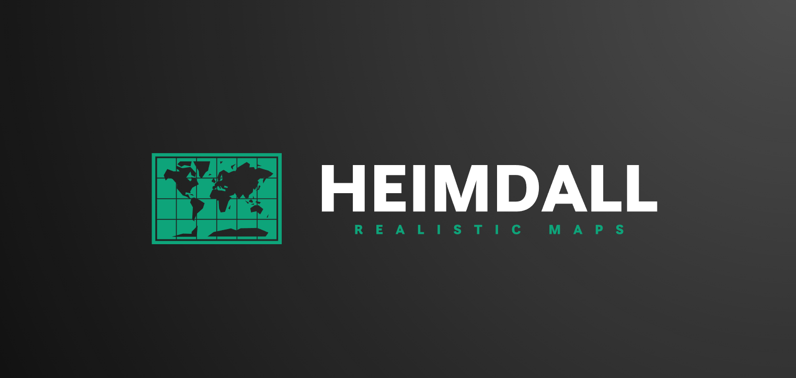

<h1 align="center">

</h1> 

# 👁️ Heimdall
Heimdall converts 2D images into seamless, realistic 3D maps using Gaussian splatting. Our innovative approach delivers unparalleled detail and accuracy, making it ideal for urban planning, virtual reality, architectural design, and environmental monitoring.

   - Improved virtual tourism 
   - Better navigation 
   - Improved urban planning

## 🔑 Workflow chart

# 📃 Preview
### Real world statue scan

### Map recreation using google satellite view

## Accomplishments that I'm proud of
- Managed to test Gaussian splatting method and Nvidias Instant NGP
- Recreated 3D models using real world data and large scale google satellite data
- Could recreate realistic 3D maps with a drone in real life, i dont have a drone :(

## What's next for Heimdall
- get funding for a drone and recreate realistic maps in 3D
- Create segment automation script to import map segments into unreal engine automatically
- Test out stable diffusion 3d upscaling 
